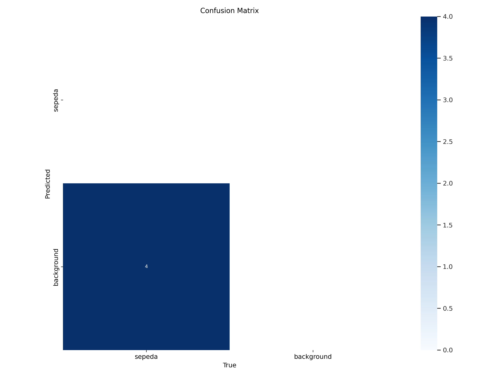
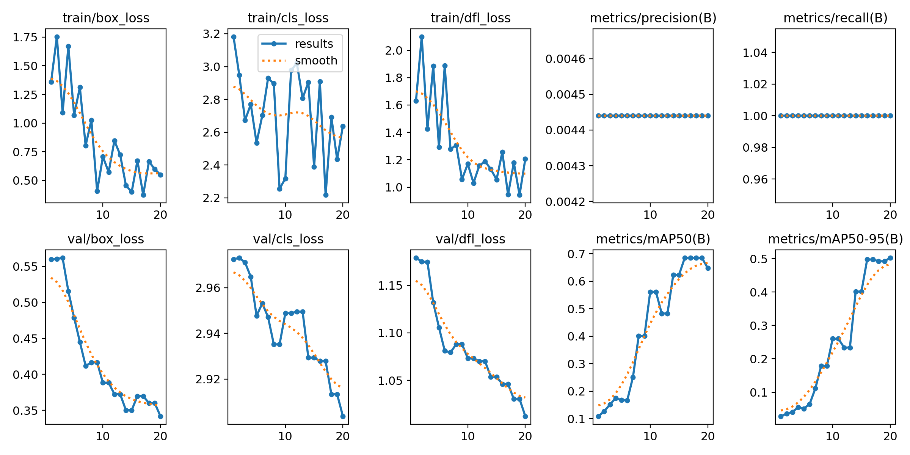

🌱 YOLOv8 Object Detection - Data Labeling Portfolio🌱

Ini adalah proyek portofolio data labeling dan pelatihan model YOLOv8 yang saya kerjakan menggunakan dataset custom untuk mendeteksi objek **Meja** dan **Kursi**.

Proyek ini mencakup proses:
- Data labeling (annotasi bounding box)
- Setup konfigurasi YOLOv8
- Training dan validasi model
- Inference untuk menguji model

---

📁 Struktur Folder 

yolov8-labeling-project/

├── [📄 Lihat file data.yaml](data/data.yaml)

├── 📂 [Buka folder `train`](./train/) # Data training

├── 📂 [Buka folder `valid`](./valid/) # Data validasi

├── 📂 [Buka folder `test`](./test/) # Data pengujian

├── README.md # Dokumentasi proyek

├── [📄 Lihat file best(2).pt](./data/best(2).pt) # Model hasil training

├── [📄 Lihat file results.md](./data/results.md)  # Catatan hasil training/inference

---

## 📦 Dataset

Dataset dibuat dan dilabeli secara manual menggunakan Roboflow, lalu diekspor dalam format YOLOv8. Label terdiri dari beberapa kelas objek relevan dengan kasus nyata.

- Jumlah gambar train: **25**
- Jumlah gambar valid: **7**
- Jumlah kelas: **(otomatis terdeteksi dari `data.yaml`)**

---

> ⚠️ Gambar & label hanya digunakan untuk keperluan edukasi dan demonstrasi portofolio.

---

## ⚙️ Model Training

Model dilatih menggunakan YOLOv8 dari library `ultralytics`.

- Training dilakukan di Google Colab 
- Hasil disimpan di: `yolov8-training/best.pt`

---

## 🔍 Inference & Evaluasi

New https://pypi.org/project/ultralytics/8.3.155 available 😃 Update with 'pip install -U ultralytics'
Ultralytics YOLOv8.2.103 🚀 Python-3.11.13 torch-2.6.0+cu124 CUDA:0 (Tesla T4, 15095MiB)
engine/trainer: task=detect, mode=train, model=yolov8n.pt, data=/content/Sepeda-1/data.yaml, epochs=20, time=None, patience=100, batch=8, imgsz=640, save=True, save_period=-1, cache=False, device=None, workers=8, project=None, name=train, exist_ok=False, pretrained=True, optimizer=auto, verbose=True, seed=0, deterministic=True, single_cls=False, rect=False, cos_lr=False, close_mosaic=10, resume=False, amp=True, fraction=1.0, profile=False, freeze=None, multi_scale=False, overlap_mask=True, mask_ratio=4, dropout=0.0, val=True, split=val, save_json=False, save_hybrid=False, conf=None, iou=0.7, max_det=300, half=False, dnn=False, plots=True, source=None, vid_stride=1, stream_buffer=False, visualize=False, augment=False, agnostic_nms=False, classes=None, retina_masks=False, embed=None, show=False, save_frames=False, save_txt=False, save_conf=False, save_crop=False, show_labels=True, show_conf=True, show_boxes=True, line_width=None, format=torchscript, keras=False, optimize=False, int8=False, dynamic=False, simplify=True, opset=None, workspace=4, nms=False, lr0=0.01, lrf=0.01, momentum=0.937, weight_decay=0.0005, warmup_epochs=3.0, warmup_momentum=0.8, warmup_bias_lr=0.1, box=7.5, cls=0.5, dfl=1.5, pose=12.0, kobj=1.0, label_smoothing=0.0, nbs=64, hsv_h=0.015, hsv_s=0.7, hsv_v=0.4, degrees=0.0, translate=0.1, scale=0.5, shear=0.0, perspective=0.0, flipud=0.0, fliplr=0.5, bgr=0.0, mosaic=1.0, mixup=0.0, copy_paste=0.0, auto_augment=randaugment, erasing=0.4, crop_fraction=1.0, cfg=None, tracker=botsort.yaml, save_dir=runs/detect/train
WARNING: All log messages before absl::InitializeLog() is called are written to STDERR
E0000 00:00:1750083699.068012   30619 cuda_dnn.cc:8310] Unable to register cuDNN factory: Attempting to register factory for plugin cuDNN when one has already been registered
E0000 00:00:1750083699.074280   30619 cuda_blas.cc:1418] Unable to register cuBLAS factory: Attempting to register factory for plugin cuBLAS when one has already been registered
Overriding model.yaml nc=80 with nc=1

Transferred 319/355 items from pretrained weights
TensorBoard: Start with 'tensorboard --logdir runs/detect/train', view at http://localhost:6006/
Freezing layer 'model.22.dfl.conv.weight'
AMP: running Automatic Mixed Precision (AMP) checks with YOLOv8n...
AMP: checks passed ✅
train: Scanning /content/Sepeda-1/test/labels... 3 images, 0 backgrounds, 0 corrupt: 100% 3/3 [00:00<00:00, 1531.51it/s]
train: New cache created: /content/Sepeda-1/test/labels.cache
/usr/local/lib/python3.11/dist-packages/ultralytics/data/augment.py:1837: UserWarning: Argument(s) 'quality_lower' are not valid for transform ImageCompression
  A.ImageCompression(quality_lower=75, p=0.0),
albumentations: Blur(p=0.01, blur_limit=(3, 7)), MedianBlur(p=0.01, blur_limit=(3, 7)), ToGray(p=0.01, method='weighted_average', num_output_channels=3), CLAHE(p=0.01, clip_limit=(1.0, 4.0), tile_grid_size=(8, 8))
val: Scanning /content/Sepeda-1/test/labels.cache... 3 images, 0 backgrounds, 0 corrupt: 100% 3/3 [00:00<?, ?it/s]
Plotting labels to runs/detect/train/labels.jpg... 
optimizer: 'optimizer=auto' found, ignoring 'lr0=0.01' and 'momentum=0.937' and determining best 'optimizer', 'lr0' and 'momentum' automatically... 
optimizer: AdamW(lr=0.002, momentum=0.9) with parameter groups 57 weight(decay=0.0), 64 weight(decay=0.0005), 63 bias(decay=0.0)
TensorBoard: model graph visualization added ✅
Image sizes 640 train, 640 val
Using 2 dataloader workers
Logging results to runs/detect/train
Starting training for 20 epochs...

      Epoch    GPU_mem   box_loss   cls_loss   dfl_loss  Instances       Size
       1/20     0.457G      1.358      3.182      1.629          7        640: 100% 1/1 [00:00<00:00,  1.14it/s]
                 Class     Images  Instances      Box(P          R      mAP50  mAP50-95): 100% 1/1 [00:00<00:00,  6.37it/s]
                   all          3          4    0.00444          1      0.109     0.0283

      Epoch    GPU_mem   box_loss   cls_loss   dfl_loss  Instances       Size
       2/20     0.417G      1.755      2.948        2.1          7        640: 100% 1/1 [00:00<00:00,  9.24it/s]
                 Class     Images  Instances      Box(P          R      mAP50  mAP50-95): 100% 1/1 [00:00<00:00, 13.65it/s]
                   all          3          4    0.00444          1      0.127     0.0357

      Epoch    GPU_mem   box_loss   cls_loss   dfl_loss  Instances       Size
       3/20     0.417G       1.09      2.673      1.425          9        640: 100% 1/1 [00:00<00:00,  9.34it/s]
                 Class     Images  Instances      Box(P          R      mAP50  mAP50-95): 100% 1/1 [00:00<00:00, 13.50it/s]
                   all          3          4    0.00444          1      0.152      0.041

      Epoch    GPU_mem   box_loss   cls_loss   dfl_loss  Instances       Size
       4/20     0.413G      1.669       2.77      1.885         11        640: 100% 1/1 [00:00<00:00,  6.53it/s]
                 Class     Images  Instances      Box(P          R      mAP50  mAP50-95): 100% 1/1 [00:00<00:00, 20.42it/s]
                   all          3          4    0.00444          1      0.174     0.0549

      Epoch    GPU_mem   box_loss   cls_loss   dfl_loss  Instances       Size
       5/20     0.436G      1.069      2.535      1.293         13        640: 100% 1/1 [00:00<00:00,  9.43it/s]
                 Class     Images  Instances      Box(P          R      mAP50  mAP50-95): 100% 1/1 [00:00<00:00, 21.20it/s]
                   all          3          4    0.00444          1      0.168      0.051

      Epoch    GPU_mem   box_loss   cls_loss   dfl_loss  Instances       Size
       6/20     0.434G      1.313      2.702      1.887          7        640: 100% 1/1 [00:00<00:00,  9.41it/s]
                 Class     Images  Instances      Box(P          R      mAP50  mAP50-95): 100% 1/1 [00:00<00:00, 21.34it/s]
                   all          3          4    0.00444          1      0.166     0.0647

      Epoch    GPU_mem   box_loss   cls_loss   dfl_loss  Instances       Size
       7/20     0.434G     0.8035      2.929      1.277          7        640: 100% 1/1 [00:00<00:00,  8.97it/s]
                 Class     Images  Instances      Box(P          R      mAP50  mAP50-95): 100% 1/1 [00:00<00:00, 21.87it/s]
                   all          3          4    0.00444          1      0.251      0.112

      Epoch    GPU_mem   box_loss   cls_loss   dfl_loss  Instances       Size
       8/20     0.436G      1.027      2.896      1.307         10        640: 100% 1/1 [00:00<00:00,  9.54it/s]
                 Class     Images  Instances      Box(P          R      mAP50  mAP50-95): 100% 1/1 [00:00<00:00, 21.45it/s]
                   all          3          4    0.00444          1      0.401      0.179

      Epoch    GPU_mem   box_loss   cls_loss   dfl_loss  Instances       Size
       9/20     0.436G     0.4058      2.255      1.058          9        640: 100% 1/1 [00:00<00:00,  9.26it/s]
                 Class     Images  Instances      Box(P          R      mAP50  mAP50-95): 100% 1/1 [00:00<00:00, 21.47it/s]
                   all          3          4    0.00444          1      0.401      0.179

      Epoch    GPU_mem   box_loss   cls_loss   dfl_loss  Instances       Size
      10/20     0.447G     0.7073      2.318       1.17         12        640: 100% 1/1 [00:00<00:00,  8.11it/s]
                 Class     Images  Instances      Box(P          R      mAP50  mAP50-95): 100% 1/1 [00:00<00:00, 19.74it/s]
                   all          3          4    0.00444          1      0.561       0.26
Closing dataloader mosaic
/usr/local/lib/python3.11/dist-packages/ultralytics/data/augment.py:1837: UserWarning: Argument(s) 'quality_lower' are not valid for transform ImageCompression
  A.ImageCompression(quality_lower=75, p=0.0),
albumentations: Blur(p=0.01, blur_limit=(3, 7)), MedianBlur(p=0.01, blur_limit=(3, 7)), ToGray(p=0.01, method='weighted_average', num_output_channels=3), CLAHE(p=0.01, clip_limit=(1.0, 4.0), tile_grid_size=(8, 8))

      Epoch    GPU_mem   box_loss   cls_loss   dfl_loss  Instances       Size
      11/20     0.434G      0.572      2.977      1.031          4        640: 100% 1/1 [00:00<00:00,  2.44it/s]
                 Class     Images  Instances      Box(P          R      mAP50  mAP50-95): 100% 1/1 [00:00<00:00,  8.24it/s]
                   all          3          4    0.00444          1      0.561       0.26

      Epoch    GPU_mem   box_loss   cls_loss   dfl_loss  Instances       Size
      12/20     0.445G     0.8462       3.02      1.158          4        640: 100% 1/1 [00:00<00:00,  9.63it/s]
                 Class     Images  Instances      Box(P          R      mAP50  mAP50-95): 100% 1/1 [00:00<00:00, 14.02it/s]
                   all          3          4    0.00444          1      0.482      0.234

      Epoch    GPU_mem   box_loss   cls_loss   dfl_loss  Instances       Size
      13/20     0.434G     0.7235      2.806      1.188          4        640: 100% 1/1 [00:00<00:00, 11.18it/s]
                 Class     Images  Instances      Box(P          R      mAP50  mAP50-95): 100% 1/1 [00:00<00:00, 14.13it/s]
                   all          3          4    0.00444          1      0.482      0.234

      Epoch    GPU_mem   box_loss   cls_loss   dfl_loss  Instances       Size
      14/20     0.445G     0.4575      2.905      1.132          4        640: 100% 1/1 [00:00<00:00,  8.25it/s]
                 Class     Images  Instances      Box(P          R      mAP50  mAP50-95): 100% 1/1 [00:00<00:00, 20.65it/s]
                   all          3          4    0.00444          1      0.622      0.401

      Epoch    GPU_mem   box_loss   cls_loss   dfl_loss  Instances       Size
      15/20     0.434G     0.3989      2.389      1.055          4        640: 100% 1/1 [00:00<00:00, 10.00it/s]
                 Class     Images  Instances      Box(P          R      mAP50  mAP50-95): 100% 1/1 [00:00<00:00, 21.86it/s]
                   all          3          4    0.00444          1      0.622      0.401

      Epoch    GPU_mem   box_loss   cls_loss   dfl_loss  Instances       Size
      16/20     0.445G     0.6728      2.908      1.256          4        640: 100% 1/1 [00:00<00:00,  8.89it/s]
                 Class     Images  Instances      Box(P          R      mAP50  mAP50-95): 100% 1/1 [00:00<00:00, 15.02it/s]
                   all          3          4    0.00444          1      0.685      0.498

      Epoch    GPU_mem   box_loss   cls_loss   dfl_loss  Instances       Size
      17/20     0.434G      0.373      2.218     0.9456          4        640: 100% 1/1 [00:00<00:00, 10.42it/s]
                 Class     Images  Instances      Box(P          R      mAP50  mAP50-95): 100% 1/1 [00:00<00:00, 21.44it/s]
                   all          3          4    0.00444          1      0.685      0.498

      Epoch    GPU_mem   box_loss   cls_loss   dfl_loss  Instances       Size
      18/20     0.445G     0.6644      2.691       1.18          4        640: 100% 1/1 [00:00<00:00,  9.43it/s]
                 Class     Images  Instances      Box(P          R      mAP50  mAP50-95): 100% 1/1 [00:00<00:00, 21.05it/s]
                   all          3          4    0.00444          1      0.685      0.492

      Epoch    GPU_mem   box_loss   cls_loss   dfl_loss  Instances       Size
      19/20     0.434G     0.5988      2.435     0.9433          4        640: 100% 1/1 [00:00<00:00, 11.31it/s]
                 Class     Images  Instances      Box(P          R      mAP50  mAP50-95): 100% 1/1 [00:00<00:00, 21.98it/s]
                   all          3          4    0.00444          1      0.685      0.492

      Epoch    GPU_mem   box_loss   cls_loss   dfl_loss  Instances       Size
      20/20     0.445G      0.549      2.637      1.207          4        640: 100% 1/1 [00:00<00:00,  8.83it/s]
                 Class     Images  Instances      Box(P          R      mAP50  mAP50-95): 100% 1/1 [00:00<00:00, 12.58it/s]
                   all          3          4    0.00444          1      0.647      0.502

20 epochs completed in 0.007 hours.
Optimizer stripped from runs/detect/train/weights/last.pt, 6.2MB
Optimizer stripped from runs/detect/train/weights/best.pt, 6.2MB

--

##🔍 Analisis

Presisi (P) = 0.99: Hampir tidak ada false positive (deteksi salah sangat rendah).

Recall (R) = 0.786: Model bisa mendeteksi ~78.6% objek yang ada (masih ada false negative).

mAP50 tinggi (0.944): Akurasi deteksi sangat baik pada IoU threshold 50%.

Kinerja Terbaik: Kelas desk lebih konsisten (R=0.857) dibanding chair (R=0.714).

## Confusion matrix

## Results

## 📬 Contact

Jika Anda ingin berdiskusi tentang proyek ini atau kolaborasi, silakan hubungi saya melalui GitHub atau LinkedIn.
